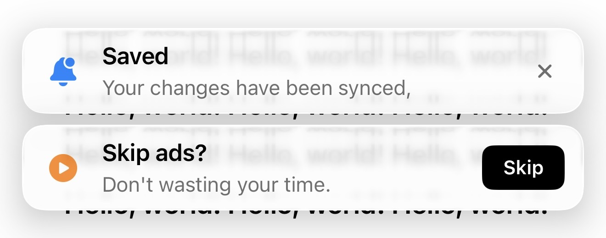

# SRNotificationView

An elegant SwiftUI notification banner component with glass morphism effect and customizable styles.

## Screenshot



## Features

- ✨ **Glass Morphism Effect**: Modern frosted glass background effect
- 🎨 **Flexible Styling**: Customize icons, colors, button styles, and more
- 📱 **Responsive Design**: Adapts to different screen sizes
- 🎭 **Multiple Display Modes**: Support for various notification types (info, skip ad, etc.)
- 🌗 **Dark Mode Support**: Automatically adapts to dark/light themes
- ⚡ **Smooth Animations**: Fluid show and hide animations
- 🔧 **Compatibility**: Supports both modern and legacy visual effects

## Installation

Simply copy the `SRNotificationView.swift` file into your project.

## Usage

### Basic Usage

```swift
SRNotificationView(
    icon: "bell.fill",
    iconColor: .blue,
    title: "New Notification",
    subtitle: "You have a new message",
    actionButtonText: nil,
    actionButtonStyle: .close,
    useLegacyEffect: false
) {
    // Callback when close button is tapped
    print("Notification dismissed")
}
```

### Notification with Action Button

```swift
SRNotificationView(
    icon: "play.circle.fill",
    iconColor: .green,
    title: "Ad Playing",
    subtitle: "Skip available in 15 seconds",
    actionButtonText: "Skip Ad",
    actionButtonStyle: .primary(backgroundColor: .black, textColor: .white),
    useLegacyEffect: false
) {
    // Skip ad action
    skipAd()
}
```

### Button Styles

The component supports multiple button styles:

- `.close`: Close button (X icon)
- `.primary(backgroundColor: Color, textColor: Color)`: Primary button style
- `.secondary(backgroundColor: Color, textColor: Color)`: Secondary button style
- `.custom(backgroundColor: Color, textColor: Color)`: Custom colors

### Complete Example

```swift
struct MyView: View {
    @State private var showNotification = true
    
    var body: some View {
        ZStack(alignment: .top) {
            // Your main content
            ScrollView {
                // ...
            }
            
            // Notification banner
            if showNotification {
                SRNotificationView(
                    icon: "checkmark.circle.fill",
                    iconColor: .green,
                    title: "Success",
                    subtitle: "Your changes have been saved",
                    actionButtonText: nil,
                    actionButtonStyle: .close,
                    useLegacyEffect: false
                ) {
                    withAnimation {
                        showNotification = false
                    }
                }
                .padding(.top, 44)
                .padding(.horizontal, 16)
                .transition(.move(edge: .top).combined(with: .opacity))
            }
        }
    }
}
```

## Parameters

| Parameter | Type | Description |
|-----------|------|-------------|
| `icon` | `String?` | SF Symbols icon name, pass `nil` to hide icon |
| `iconColor` | `Color` | Icon color |
| `title` | `String` | Notification title (required) |
| `subtitle` | `String?` | Notification subtitle, pass `nil` or empty string to hide |
| `actionButtonText` | `String?` | Action button text, pass `nil` to show close button |
| `actionButtonStyle` | `ActionButtonStyle` | Button style |
| `useLegacyEffect` | `Bool` | Whether to use legacy glass effect |
| `onAction` | `() -> Void` | Callback when button is tapped |

## Glass Morphism Effect

The component uses a compatible glass morphism effect:

- iOS 18+ or macOS 15+: Uses `.thinMaterial` effect
- Older versions: Simulates effect with semi-transparent background

You can force the legacy effect using the `useLegacyEffect` parameter.

## Requirements

- iOS 15.0+
- macOS 12.0+
- SwiftUI

## License

MIT License

## Author

Created by rexshi on 2025/11/1.

## Contributing

Issues and Pull Requests are welcome!
